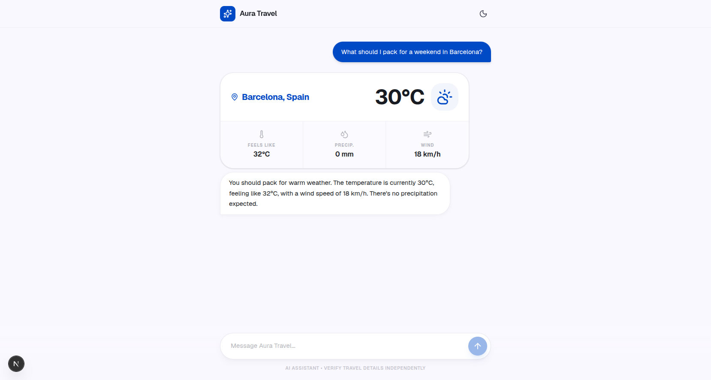

# Aura Travel — AI Weather & Travel Assistant

A conversational travel assistant that **streams** its answers token-by-token and
calls a **live weather tool** when you ask about conditions anywhere in the world.
Built to explore real LLM integration patterns — streaming, function calling, and
the UX around them.

**🔗 Live demo:** _coming soon (deployed on Vercel)_

<!-- TODO: add a GIF showing a live streamed answer + the weather card -->


## What it does

- **Streaming chat** — the model's reply appears gradually, word by word, instead
  of all at once.
- **Function calling (tool use)** — when you ask about the weather, the model calls
  a `getWeather` tool that fetches **real data** from Open-Meteo. The numbers are
  never made up: the model only phrases data our code retrieved.
- **Live tool feedback** — the UI shows "Checking weather in …" while the tool
  runs, then renders a weather card (temperature, feels-like, precipitation, wind).
- **Polished UX** — light/dark mode, a stop button to interrupt generation, a
  "thinking" indicator, graceful error handling with retry, and auto-scroll.

## Tech stack

- **[Next.js](https://nextjs.org) (App Router)** + **TypeScript**
- **[Vercel AI SDK](https://ai-sdk.dev)** — `streamText`, `useChat`, tool calling
- **[Google Gemini](https://ai.google.dev)** (`gemini-2.5-flash-lite`) via `@ai-sdk/google`
- **[Open-Meteo](https://open-meteo.com)** — free weather + geocoding APIs (no key)
- **[Tailwind CSS](https://tailwindcss.com) v4** + **[lucide-react](https://lucide.dev)** icons
- **[Zod](https://zod.dev)** — schema for the tool's input

## How it works

The browser never talks to the model directly — an API route acts as a secure proxy
so the API key stays on the server.

```
User types a message
  → POST /api/chat  (app/api/chat/route.ts)
    → streamText() calls Gemini with the getWeather tool available
      → model decides it needs data → calls getWeather({ city })
        → our code fetches Open-Meteo (geocoding → forecast)
      → real data returns to the model
    → model streams the final answer
  → useChat renders it live in the browser (app/page.tsx)
```

The key idea: **accuracy comes from grounding the model with a tool**, not from the
model's own knowledge. That's why a small, fast model is enough for correct weather.

## Run it locally

```bash
# 1. Install dependencies
npm install

# 2. Add your Google Gemini API key (free — https://aistudio.google.com)
echo "GOOGLE_GENERATIVE_AI_API_KEY=your-key-here" > .env.local

# 3. Start the dev server
npm run dev
```

Open [http://localhost:3000](http://localhost:3000) and ask, e.g., _"What's the
weather in Kraków?"_

> **Note:** the free Gemini tier has a per-minute request limit. If you send many
> messages quickly you may briefly see an error — just wait a moment and retry.

## Project structure

```
app/
  api/chat/route.ts   # backend: streamText + getWeather tool (Zod + Open-Meteo)
  page.tsx            # frontend: useChat, message list, weather card, theme toggle
  layout.tsx          # fonts, metadata, no-flash theme script
  globals.css         # Tailwind v4 theme tokens (light + dark)
```
